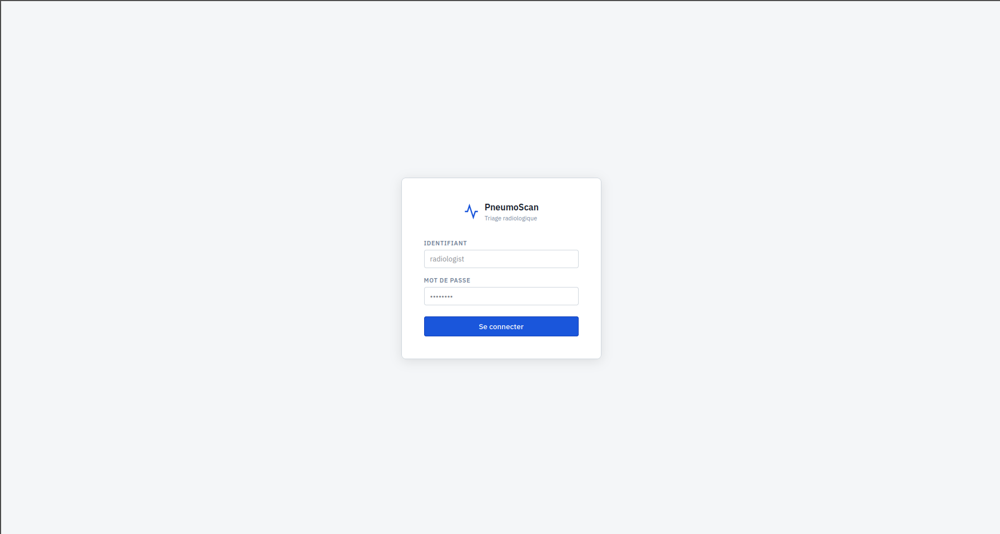
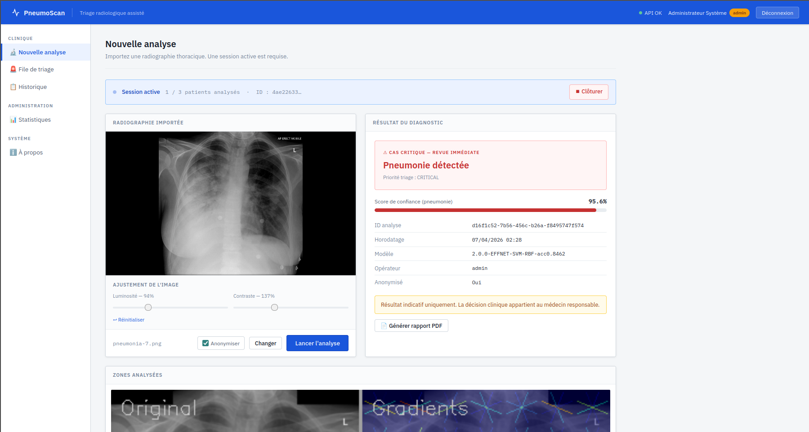
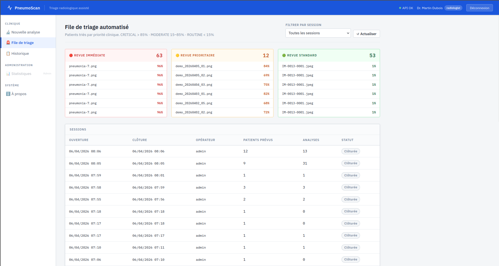
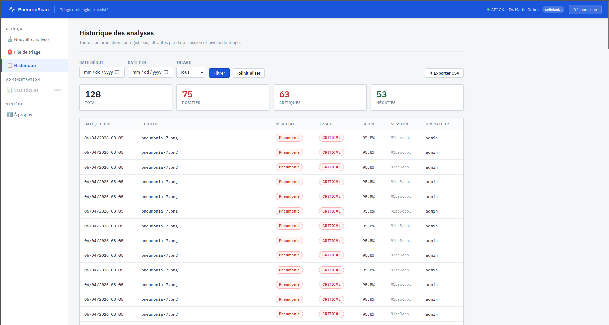
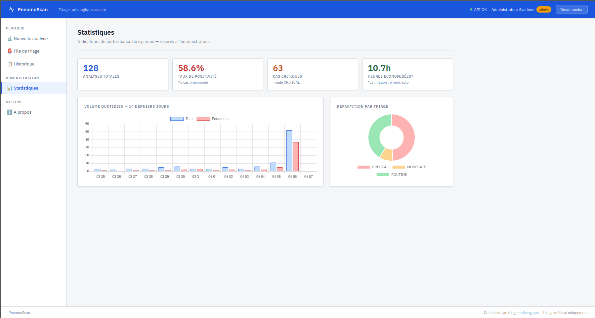

# PneumoScan

Plateforme web de triage radiologique pour la détection de pneumonie.

PneumoScan intègre une architecture complète:
- Backend FastAPI (authentification JWT, API REST, traçabilité)
- Frontend Vue.js (workflow clinique complet)
- Pipeline IA (mode principal EfficientNet-B0 + SVM, fallback HOG + PCA + SVM)
- Base SQLite (historique, sessions, statistiques)
- Déploiement Docker Compose

## Fonctionnalités principales

- Authentification par rôles (`radiologist`, `admin`)
- Ouverture / clôture de sessions de travail
- Analyse RX avec score de confiance et niveau de triage
- Priorisation des cas (`CRITICAL`, `MODERATE`, `ROUTINE`)
- Visualisation des zones contributives (explicabilité)
- Historique filtrable + export CSV
- Tableau de bord administrateur (KPI + graphiques)
- Génération de rapport PDF

## Aperçu de l'interface

### Connexion


### Nouvelle analyse


### File de triage


### Historique


### Dashboard administrateur


## Arborescence du dépôt

```text
.
├── backend/
│   ├── main.py
│   ├── predictor.py
│   ├── services.py
│   ├── database.py
│   ├── auth.py
│   ├── scanner.py
│   └── model/
├── frontend/
│   └── index.html
├── assets/
├── heatmaps/
├── incoming_scans/
├── data/
├── docker-compose.yml
└── Makefile
```

## Démarrage rapide (Docker)

### 1) Démarrer l'application
```bash
docker compose up --build
```

Ou via le Makefile:
```bash
make
```

### 2) Accéder aux services

| Service | URL |
|---|---|
| Frontend | http://localhost:3000 |
| API | http://localhost:8000 |
| Swagger | http://localhost:8000/docs |

## Développement local (sans Docker)

### Backend
```bash
cd backend
python -m venv .venv
source .venv/bin/activate
pip install -r requirements.txt
uvicorn main:app --reload
```

### Frontend
```bash
cd frontend
python -m http.server 3000
```

## Endpoints API essentiels

| Méthode | Endpoint | Description |
|---|---|---|
| POST | `/auth/token` | Connexion et récupération JWT |
| GET | `/auth/me` | Profil utilisateur courant |
| POST | `/predict` | Analyse d'une radiographie |
| GET | `/history` | Historique des analyses |
| GET | `/dashboard` | KPI admin |
| GET | `/health` | État du service |

## Exemple d'appel `/predict`

```bash
curl -X POST "http://localhost:8000/predict" \
  -H "Authorization: Bearer <TOKEN>" \
  -F "file=@chest_xray.png"
```

## Notes IA

- Mode principal: `EfficientNet-B0 + SVM`
- Mode fallback: `HOG + PCA + SVM`
- Vérification OOD avant inférence pour rejeter les images hors distribution

## Avertissement médical

Ce projet est un prototype académique d'aide au triage.
Il ne remplace pas l'évaluation clinique d'un radiologue qualifié.
